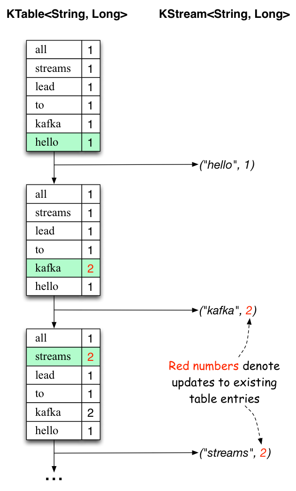
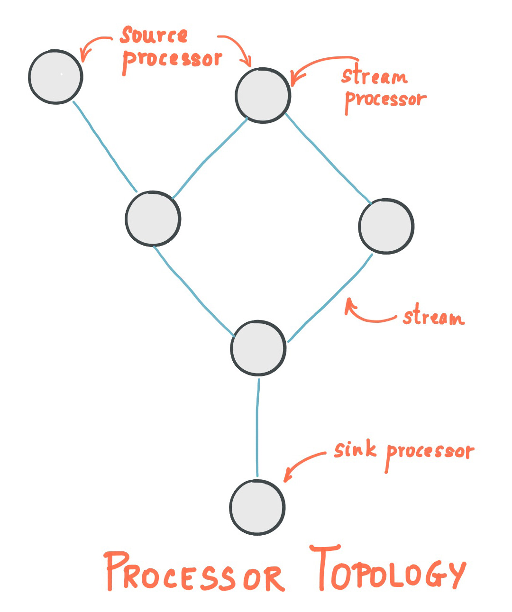

# Kafka Installation
* download: https://www.apache.org/dyn/closer.cgi?path=/kafka/2.6.0/kafka_2.13-2.6.0.tgz
* $tar -xvzf ~/Downloads/kafka_2.13-2.6.0.tgz -C ~/tools/
# Starting Kafka
* $cd ~/tools/kafka_2.13-2.6.0
* start zookeeper first:
* $bin/zookeeper-server-start.sh config/zookeeper.properties
* start kafka broker service
  * $bin/kafka-server-start.sh config/server.properties
* create a topic called 'quickstart-events' for events
  * $ bin/kafka-topics.sh --create --topic quickstart-events --bootstrap-server localhost:9092
* Start producer client to add events to the topic - add some string messages after running the command
  * $ bin/kafka-console-producer.sh --topic quickstart-events --bootstrap-server localhost:9092
* Read events from the consumer client
  * $ bin/kafka-console-consumer.sh --topic quickstart-events --from-beginning --bootstrap-server localhost:9092

#Kafka Concepts & Architecture
* __Event Streaming:__ Practice of capturing data in real-time from event sources like databases, sensors, mobile devices, cloud services, and software applications in the form of streams of events
* _"digital equivalent of the human body's central nervous system. It is the technological foundation for the 'always-on' world where businesses are increasingly software-defined and automated, and where the user of software is more software"_
* Storing the event streams durably for later retrival
* Manuplating, processing and reacting to event streams in real-time as well as in retrospective.
* Ensures continuous flow and interpretation of data so that right informaton is at right place, at right time.

#Usages of Event Streams
* Payments and financial transactions in real time - stock exchanges, banks, insurances
* Track and monitor cars, trucks, fleets, and shipments in real-time - logistics, automotive industry.
* Continuous capture and analyze sensor data from IoT devices - factories, external devices etc.
* Collect and immediately react to customer interactions and orders - retail, hotel, travel, mobile apps, etc
* Patient monitoring in hospitals, predict changes in condition and ensure timely treatment in emervencies
* To connect, store and make available data produced by diffrent division/depts of enterprise/company.
* Serve as foundation for data platforms, event-driven architectures, and microservices

# Kafka as an Event Streaming platform
* Publish (write) and Subscribe (read) stresms of events.
* Continuous import/export of your data from other systems
* Store streams of events durably and reliably as long as wanted
* Process streams of events as they occur or retrospectively

# Kafka working mechanism
* Is a distributed system of servers and clients.
* Communicate between themselves via high performance TCP
  * [Kafka Protocol](https://kafka.apache.org/protocol.html)
* Deployments - bare-metal hardware, VMs, Containers, On-Prem, Cloud
* __Servers:__ Run as cluster of servers, span multiple datacenters, or cloud regions
  * some of the servers form the storage layer, called _brokers_
  * other servers run Kafka Connect to continuously import/export data as Event Streams to integrate Kafka with other systems - DBs as well as other Kafka Clusters.
  * For misson critical use cases
  * Kafka cluster is highly scalable and fault tolerant.
* __Clients:__ Allow to write distreibuted applications and microservices that read, write and process streams of events in parallel, at scale, fault-tolerant (network or machine)
  * Kafka ships with some clients included (java, scala) including the high level _Kafka Streams_ library.
  * [Clients Provided by community](https://cwiki.apache.org/confluence/display/KAFKA/Clients)
  

# Kafka Concepts
* __event:__ record or message, has key, value, timestamp
* __topic:__ events are stored durably in topics.
  * topics in Kafka are multi-producer and multi-consumer.
  * events in topics can be read as many times as possible.
  * events are not deleted after consumption.
  * can define how long can Kafka retain the event through per-topic configuration setting.
  * Kafka's performance is effectively constant w.r.t data size. so storing data for long time is perfectly fine.
* __Producer__
  * are client applications that publish (write) events to Kafka topics. 
* __consumer__
  * are client applications that subscribe (read) events from Kafka topics. 
* __partition__
  * topics are partioned, i.e a topic is spread over a number of buckets located in diffrent _Kafka Brokers_
  * Distributed placement of data is important for scalability. Allows client applications to both read and write data from/to many _Kafka Brokers_ at same time.
  * When a event is published to a topic, it is actually appended to one of the topics partition.
  * Events with the same event key (e.g custID, vehicleID..) are written to same partition.
  * Kafka guarantees that any consumer of a given topic-partition will always read that partition's events is exactly same order as they were written.
* __storage__

* __replicated__
  * for making data fault-tolerant and highly-available, every topic can be replicated.
  * replicated across geo-regions or datacenters
  * multiple _Kafka Brokers_ have the copy of the data.
  * common/default replication factor is 3
* 

# Kafka APIs
* [Admin API](https://kafka.apache.org/documentation.html#adminapi) - to manage and inspect topics, brokers, and other Kafka objects.
* [Producer API](https://kafka.apache.org/documentation.html#producerapi) - to publish (write) a stream of events to one or more Kafka topics.
* [Consumer API]() - to subscribe to (read) one or more topics and to process the stream of events produced to them.
* [Kafka Streams API](https://kafka.apache.org/documentation/streams) - to implement stream processing applications and microservices. It provides higher-level functions to process event streams, including transformations, stateful operations like aggregations and joins, windowing, processing based on event-time, and more. Input is read from one or more topics in order to generate output to one or more topics, effectively transforming the input streams to output streams.
* [Kafka Connect API](https://kafka.apache.org/documentation.html#connect) - to build and run reusable data import/export connectors that consume (read) or produce (write) streams of events from and to external systems and applications so they can integrate with Kafka. For example, a connector to a relational database like PostgreSQL might capture every change to a set of tables. However, in practice, you typically don't need to implement your own connectors because the Kafka community already provides hundreds of ready-to-use connectors.

#Basic Demo to get started with Kafka
* [Basic Demo - Quick Start](https://kafka.apache.org/quickstart)
  * _$cd ~/tools/kafka_2.13-2.6.0/_
  * Start Zookeeper(terminal-1): _$bin/zookeeper-server-start.sh config/zookeeper.properties_
  * Start Kafka Broker Service(terminal-2): _$bin/kafka-server-start.sh config/server.properties_
  * Create a topic from cmd-line(terminal-3): _$bin/kafka-topics.sh --create --topic quickstart-events --bootstrap-server localhost:9092_
  * Describe the topic created (terminal-3): _$bin/kafka-topics.sh --describe --topic quickstart-events --bootstrap-server localhost:9092_
  * Write event to the topic (terminal-3): _$bin/kafka-console-producer.sh --topic quickstart-events --bootstrap-server localhost:9092_
    * _>My first event_
    * _>My second event_
  * Read the events (terminal-4): _$bin/kafka-console-consumer.sh --topic quickstart-events --from-beginning --bootstrap-server localhost:9092_

* [Kafka Streams Demo - Quick Start](https://kafka.apache.org/25/documentation/streams/quickstart)
  * run WordCount from maven: _$mvn exec:java -Dexec.mainClass=kafka.streams.demo.WordCount_
  * run WordCount form console: _$bin/kafka-run-class.sh kafka.streams.demo.WordCount_
  * Demo Event published ("All streams lead to kafka","hello kafka streams", "join kafka summit")
    * 
    * 
*[Kafka Streams Tutorial](https://kafka.apache.org/25/documentation/streams/tutorial)

# Process events as kafka streams
* Kafka Streams
  * https://kafka.apache.org/25/documentation/streams/quickstart
  * https://kafka.apache.org/25/documentation/streams/tutorial
* is a client library for building mission-critical real-time applications and microservices
* the input and/or output data is stored in Kafka clusters.
* simplicity of writing and deploying standard Java and Scala applications on the client side
* with the benefits of Kafka's server-side cluster technology to make these applications highly
  * scalable,
  * elastic,
  * fault-tolerant,
  * distributed
  * and much more.
  
* Kafka Stream API - cheatsheet
  * SerDes: Serilizer Deserializer
  * StreamBuilder: builder.stream("topic-input").to("topic-out")
  * KStream: builder.stream("xxx"),
    * KStream: .flatMapValues(lambda-fun), ..
    * KGroupedStream: .groupBy(...)
    * KTable: .count(Materialized.<...>as()) //Generics Method concept
  * Topology: builder.build()
    * topology.describe()
  * StreamConfig.xxxx > properties
  * Topology
  * KafkaStreams(topology, props)
  * CountDownLatch

# Kafka Streams Concept
## Concepts:
* (ref: https://kafka.apache.org/25/documentation/streams/core-concepts)
* Event Time
* Processing Time
* Windowing  Support
* real time querying of application state
* Easy(low barrier to entry)::
  * poc code on single machine to high-volume production loads
  * just add more instances
  * Kafka Streams transparently handles loadbalancing
    * leveraging Kafka parallelism model.
* Highlights of Kafka streams
  * simple and lightweight client library
  * no external dependencies other than apache kafka
  * fault-tolerant local state
  * exactly-once
  * one record at a time processing
    * event based windowing operations
    * supports out of order arrival of records
  * Provides stream processing primitives
  * high-level stream DSL
  * low-level Processor API
## Stream Processing Topology
* **Stream:**
  * ubounded continiously updating data set
  * ordered, replayable, fault-tolerant sequence of immutable data records.
  * data record: key-value pair.]
* **Stream Processing application:*
  * defines its computational logic through one or more Processor Topologies.
  * Processor Topologies:
    * graph of Stream Processors(nodes) that are connected by streams(edges)
* **Stream Processor:**
  * (ref: https://kafka.apache.org/25/documentation/streams/developer-guide/processor-api#defining-a-stream-processor)
  * A node in a processing topology that represents a single processing step.
  * One input record at a time, from upstream processor in the topology --> applying  operation to it producing one or more output records to downstream processors
  * 2 special processors in the Topology
  * **Source Processor:**
    * A stream processor that has no upstream processors.
    * Produces an input stream to its topology from one or multiple kafka topics by consuming records
    * Forwards the input stream to its downstream processors. 
  * **Sink Processor:**
    * A special type of stream processor that does not have downstream processors.
    * Sends any received records from upstream processors to specified kafks topic.
    * 
## Defining a Stream Processing Topology
* 2 ways of defining
* Kafka Streams DSL
  * _map, filter, join, aggregations etc..._ are provided out of the box
  * Processor API - allows to define custom processors as well as to interact with _state stores_
  * Processing Topology is a logical abstraction of the stream processing code
  * At runtime logical topology is instantiated and replicated inside the application for parallel processing.

## Time
* Critical aspect of stream processing is Time
  * __Event Time:__ Point in time when an event or data record occured.
  * __Ingestion Time:__ Point in time when an event or data record is stored in a topic partition by Kafka Broker.
  * __Processing Time:__ Point in time when the event or data record happens to be processed by the stream processing application, ie when the record is being consumed.
  * Choice between __Event Time__ and __Ingestion Time__ is done while configuring Kafka (NOT kafka streams)
  * The default timestamp extractor in kafka streams will retriev the timestamp as-is.
  * _Effective Time Semantics_ depends on the effective Kafka configuration for the embedded timestamps. 
  * Can be set at _Broker_ or _per Topic_ level.
  * __Stream Time:__ Kafka Streams assigns a timestamp to every data record via the _TimestampExtractor_ interface.
    * These are per-record timestamps.
    * Describe the progress of a stream with regard to time.
    * These are used/leveraged by time-dependant operations such as window operations.
    * Stream Time will advance when a new record arrives at the processor.
    * Concrete implementations of _TimestampExtractor_ interface will then provide diffrent semantics for _Stream Time_ definition.
      * __wall-clock-time:__ Time when the application is actually executing.
      * Developers can enforce diffrent notions of time depending on business needs. Eg.
      	* Retreiving or computing timestamp based on embedded timestamp field to provide event time semantics.
	* Retreiving _wall-clock-time_ to provide time semantics.
  * Whenever Kafka Streams application writes records to Kafka, it will also assign timestamps to these new records.
    * inherited from input record timestamps eg. _context.forward()_
    * (or) current internal timestamp, eg. _context.timestamp()_
    * for aggregations - eg. maximum timestamp of all input records.

## Aggregations
* Aggregation operation takes one input stream or table, and yields a new table by combining multiple input records into single output record.
  * Eg. computing count or sum
* In Kafka Stream DSL input stream(KStream or KTable), output stream will be KTable.
* This allows Kafka Streams to update an aggregate value to be updated out-of-order arrival of futhur records after value was produced and emitted.
* When out-of-order happens, aggregating KStream or KTable will a new aggregate value - will overwrite old value with the same key for subsequent processing steps.

## Windowing
* Lets one control how to group records having same key for stateful operations like _aggregations_ of _joins_
* Windows are tracked per record key
* _Windowing operations_ are available in the Kafka Streams DSL.
* Specify a __grace period__ for the window - How long Kafka Streams will wait for __out-of-order__ data records for a given window.
* Data record arrives after the grace period - the record is discarded and will not be processed for that window.[ record timestamp > (window time + grace period)] 
* out-of-order records are possible in real world.
  * Should be properly accounted in applications.
  * How __out-of-order__ records are handled depends on _Effective Time Semantics_
  * When the semantics are "when records are being processed" i.e a case of __Processing Time__, no record can be __out-of-records__
  * Kafka Streams is able to properly handle _out-of-order_ records.

## Duality of Streams and Tables
* Stream processing needs both streams and databases.
  * eg. Enriching incomming stream of customer Tx with latest customer information from database table.
  * Stream processing technology must provide first class support for streams and tables.
  * There is a close relationship between streams and tables. [Stream Table duality]
  * Kafka exploits this duality to provide
    * make applications elastic
    * support fault tolerant stateful processing
    * run interactive queries against applications latest processing results.
    *  Kafka Stream API allows developers to exploit this duality in applications.

## States
* Stream processing can be stateless. i.e processing of a message is independant of processing of all other messages.
* Being able to maintain a state opens up a many possibilities for sophisticated stream processing applications.
  * join input streams
  * group and aggregate data records
  * __[Kafka Stream DSL](https://kafka.apache.org/25/documentation/streams/developer-guide/dsl-api.html)__ supports many stateful operators.
* Kafka Streams provide __state stores__
  * Can be used by stream processing applications to store and query data.
  * Every task in Kafka Streams embeds one or more _state stores_ that can be accessed to store andquery data required for processing via APIs
  * _state stores_ can be
    * a persistent key-value store
    * an in-memory hashmap
    * or other convinient data structure
  * Kafka Streams offers fault-tolerant and automatic recovery for local stores.
  * Kafka Streams have a feature called __Interactive Queries__
    * Allows direct read-only queries of _state stores_ by methods, threads, processes/applications external to the stream processing application that created the _state stores_.
    * All _state stores_ are named and __Interactive Queries__ exposes only the read operations of the underlying implementation.

## Processing Guarantees
* __exactly once__ stream processing.
* default is set at __at_least_once__
* Failing to guarantee exactly-once is a deal breaker for applications that cannot tolerate any data-loss or data duplicates.
* Kafka has added support for producers to send messages to diffrent topic partions in a _transactional_ and _idempotent manner_.
* Kafka guarentees that any record read from source kafka topics, the processing results will be reflected exactly once in the output _kafka topic_ as well as in the _state stores_ (for stateful operations)
* Kafka Streams tightly integrates with the underlying Kafka storage system and ensure that commits on the input topic offsets, updates on the state stores, and writes to the output topics will be completed atomically instead of treating Kafka as an external system that may have side-effects.
* Ref: for Deep Dive [KIP-129](https://cwiki.apache.org/confluence/display/KAFKA/KIP-129%3A+Streams+Exactly-Once+Semantics)
* Configuration for setting the quarantee
  * _processing.guarantee=[exactly_once|at_least_once]_

## Out-of-Order Handling
* 2 potential causes in Kafka Streams for out-of-order data arrivals w.r.t timestamp
  * <paused and jumped to kafka concepts and arch.>

# Kafka Streams Architecture
* [Kafka Architecture](https://kafka.apache.org/25/documentation/streams/architecture)
  
  